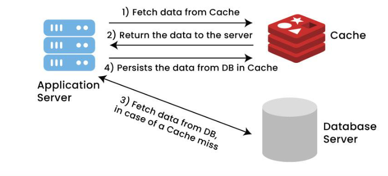

# Redis Notları

## Caching Nedir?

Yazılım süreçlerinde verilere daha hızlı erişebilmek için bu verilerin bellekte saklanmasına **caching (önbellekleme)** denir.

Bilgisayar sistemlerinde kullanılan bellek türleri arasında hız ve kapasite açısından belirgin farklılıklar bulunur. Örneğin sabit diske kıyasla RAM, verilere anlık erişim açısından çok daha hızlıdır. Bu fark, belirli verilerin RAM’de tutulmasını yazılım açısından avantajlı hale getirir.

Caching, veri erişim hızını artırır ve aynı verilerin tekrar tekrar elde edilmesi gereken durumlarda sunucunun yükünü hafifletir. Çünkü veriler önceden cache’de saklandığı için, ihtiyaç duyulduğunda doğrudan bellekteki veriye ulaşılır. Böylece hem yanıt süresi kısalır hem de sistem kaynakları daha verimli kullanılır.



### Hangi Tür Veriler Cache’lenir?

Cache’lenecek veriler, **sıklıkla erişilen** ve **hızlı ulaşılması gereken** verilerdir. Bunlara örnek olarak:

- Sık kullanılan veritabanı sorgularının sonuçları
- Konfigürasyon (yapılandırma) verileri
- Menü bilgileri
- Yetkilendirme (authorization) verileri

Ancak her verinin cache’lenmesi uygun değildir. Özellikle **sürekli güncellenen**, **kişisel bilgi içeren** veya **güvenlik açısından risk oluşturabilecek** verilerin cache’lenmesi önerilmez. Çünkü bu tür veriler cache’te güncelliğini yitirirse sistemin yanlış veya eski veriyle çalışmasına yol açabilir.

---

### Cache Mekanizmasının Temel Bileşenleri

- **Cache Belleği:**

    Verilerin saklandığı ve hızlı erişim için kullanılan bellek alanıdır.

- **Cache Bellek Yönetimi:**

    Cache belleğinde saklanan verilerin ne kadar süreyle tutulacağı, ne zaman silineceği ve nasıl güncelleneceği gibi süreçleri yönetir.

- **Cache Algoritması:**

    Verilerin cache belleğe nasıl ekleneceğini ve ne zaman silineceğini belirleyen algoritmadır. (Örneğin: LRU – *Least Recently Used*, LFU – *Least Frequently Used*, FIFO vb.)


> Not: Cache bellek yönetimi yapılırken, verilerin türüne ve kullanım sıklığına göre cache süreleri farklılık gösterebilir. Bu nedenle her veri tipi için uygun bir süre belirlemek performans açısından kritik öneme sahiptir.
>

---

## Caching Yaklaşımları

Caching uygulamak için iki temel yaklaşım bulunur:

1. **In-Memory Caching:**

    Veriler, uygulamanın çalıştığı bilgisayarın belleğinde (RAM) tutulur. Bu yöntem oldukça hızlıdır, ancak veriler yalnızca tek bir sunucuda bulunduğundan ölçeklenebilirlik sınırlıdır.

2. **Distributed Caching:**

    Veriler birden fazla sunucuda paylaşılır ve bu sayede veriler farklı fiziksel noktalarda bulunur. Bu yöntem, yüksek erişilebilirlik ve hata toleransı sağlar. Büyük ölçekli sistemlerde genellikle Redis veya Memcached gibi teknolojilerle uygulanır.


Distributed caching, sistemin farklı bileşenleri arasında **veri bütünlüğü**, **güvenlik** ve **yük dengeleme** açısından daha güvenilir bir yapı sunar.

## Redis Veri Türleri :

| Veri Yapısı | Açıklama |
| --- | --- |
| String | Redis'in en temel, en basit veri türüdür. Metin, sayı veya binary veri saklamak için kullanılır. Hatta binary olarak resim, dosya vs. verileri de saklanabilmektedir. |
| List | Değerleri koleksiyonel olarak tutan bir türdür. |
| Set | Verileri rastgele bir düzende unique bir biçimde tutan veri türüdür. |
| Sorted Set | Set'in düzenli bir şekilde tutulan versiyonudur. |
| Hash | Key-Value formatında veri tutan türdür. |
| Streams | Log gibi hareket eden bir veri türüdür. Streams, event'lerin oluştukları sırayla kaydedilmelerini ve daha sonra işlenmelerini sağlar. |
| Geospatial Indexes | Coğrafi koordinatların saklanmasını sağlayan veri türüdür. |

### Redis Strings :

| KOMUT | İŞLEVİ | ÖRNEK |
| --- | --- | --- |
| SET | Ekleme | SET NAME hilmi |
| GET | Okuma | GET NAME |
| GETRANGE | Karakter Aralığı Okuma | GETRANGE NAME 1 2 |
| INCR & INCRBY | Arttırma | INCR SAYI |
| DECR & DECRBY | Azaltma | DECR SAYI |
| APPEND | Üzerine Ekleme | APPEND NAME celayir |

### Redis Lists

| KOMUT | İŞLEVİ | ÖRNEK |
| --- | --- | --- |
| LPUSH | Başa Veri Ekleme | LPUSH NAMES hilmi ahmet |
| LRANGE | Verileri Listeleme | LRANGE NAMES 0 -1 |
| RPUSH | Sona Veri Ekleme | RPUSH NAMES rifki |
| LPOP | İlk Datayı Çıkarma | LPOP NAMES |
| RPOP | Son Datayı Çıkarma | RPOP NAMES |
| LINDEX | İndexe Göre Datayı Getirme | LINDEX NAMES 1 |
|  |  |  |

### Redis Set

| KOMUT | İŞLEVİ | ÖRNEK |
| --- | --- | --- |
| SADD | Ekleme | SADD COLOR red blue green orange |
| SREM | Silme | SREM COLOR blue |
| SISMEMBER | Arama | SISMEMBER COLOR red |
| SINTER | İki Set'teki Kesişimi Getirir | SINTER user1:BOOKS user2:BOOKS |
| SCARD | Eleman Sayısını Getirir | SCARD COLOR |

### Redis Sorted Set

Birbirinden farklı değerleri sıralı bir şekilde ve unique olarak tutan bir veri türüdür. Her seviye score adı verilen değer atanır ve bu değerler kullanılarak veriler sıralanır.

| KOMUT | İŞLEVİ | ÖRNEK |
| --- | --- | --- |
| ZADD | Ekleme | ZADD TEAMS 1 A |
| ZRANGE | Getirme | ZRANGE TEAMS 0 -1<br>ZRANGE TEAMS 0 -1 WITHSCORES |
| ZREM | Silme | ZREM TEAMS A |
| ZREVRANK | Sıralama Öğrenme | ZREVRANK TEAMS B |

### Redis Hash

Key-Value formatında veri tutan veri türüdür.

| KOMUT | İŞLEVİ | ÖRNEK |
| --- | --- | --- |
| HMSET & HSET | Ekleme | HMSET EMPLOYEES username gncv<br>HSET EMPLOYEES username gncv |
| HMGET & HGET | Getirme | HMGET EMPLOYEES username |
| HDEL | Silme | HDEL EMPLOYEES username |
| HGETALL | Tümünü Getirme | HGETALL EMPLOYEES |

## In-Memory Caching :

Aşağıdaki işlem sırasını takip ederek uygulamalarınızda redis in-momory cache’İ implement edebilirsiniz.

1. **AddMemoryCache** servisini uygulamaya ekleyiniz.
2. **IMemoryCache** referansını inject ediniz.
3. **Set** metoduyla veriyi cache'leyebilir, **Get** metoduyla cache'lenmiş veriyi elde edebilirsiniz.
4. **Remove** fonksiyonuyla cache'lenmiş veriyi silebilirsiniz.
5. **TryGetValue** metodu ile kontrollü bir şekilde cache'den veriyi okuyabilirsiniz.

Absolute Time :  Cachedeki datanın ne kadar tutulacağına dair net ömrünün belirtilmesidir. Belirtilen süre sona erdiğinde cache direkt olarak temizlenir.

Sliding Time : Cachelenmiş datanın memory’de belirtilen süre içerisinde tutulmasını belirtir .Belirtilen süre içerisinde cache’e yapılan erişim neticesinde de datanın ömrü bir o kadar uzatılır.Belirtilen süre zarfında erişim olmazsa cache temizlenir.


## Distrubuted Cache :

Distrubuted cache yaklaşımını uygulamanıza implemente etmek için aşağıdaki yaklaşımı takip edebilirsiniz :

- **StackExchangeRedis** kütüphanesini uygulamaya yükleyiniz.
- **AddStackExchangeRedisCache** servisini uygulamaya ekleyiniz.
- **IDistributedCache** referansını inject ediniz.
- **SetString** metodu ile metinsel, **Set** metodu ile ise binary olarak verilerinizi redis'e cache'leyebilirsiniz. Aynı şekilde **GetString** ve **Get** fonksiyonlarıyla cache'lenmiş verileri elde edebilirsiniz.
- **Remove** fonksiyonu ile cache'lenmiş verileri silebilirsiniz.


## Redis/ Pub-Sub ve Message Broker

Redis ağırlıklı olarak caching yönüyle tercih ediliyor olsa da , bir message broker olarak da kullanılabilmektedir. Rediste bu pub-sub işlemini gerçekleştirmek için birkaç farklı yöntem mevcuttur. Redis CLI, pub/sub işlemlerini yönetmek için kullanışlı bir araçtır. Redis'teki verileri sorgulamak ve pub/sub işlemlerini test etmek amacıyla kullanılabilir. Redis'in pub/sub işlemi gerçekleştirilebilmesi için çeşitli dil ve platformlarda kütüphaneler mevcuttur. Node.js için redis-node, Python için redis-py, .NET Core için StackExchange.Redis gibi kütüphaneler kullanılabilir.

### Redis Pattern-Matching Subscription

Redis, Pattern-Matching Subscription modeli sayesinde abonelerin belirli kalıplara (pattern) ya da desenlerde mesajlar almasını sağlamaktadır. Bu model, abonelerin birden fazla farklı pattern'lara sahip kanallardan mesaj almasını yahut belirli bir kalıba uyan kanalları filtrelemesini mümkün kılar. Misal olarak, bir abonenin sadece 'stock.*' pattern'ına uygun olan kanallardan almasını isterseniz; 'stock.apple', 'stock.google' ve 'stock.amazon' gibi kanallardan mesajları alabilir ancak 'news.tech' isimli kanaldan ise doğal olarak mesajları filtrelemiş olursunuz

## Redis Replication

Redis ile sunucudaki verilerin güvenliğini sağlamak için replication gibi önlemler alınabilir. Replication, bir Redis sunucusundaki tüm verilerin farklı bir sunucu üzerinde birebir kopyalanması işlemidir. Buradaki replication davranışında, replikası alınacak sunucuya master adı verilir. Master'ın replikasını alan sunucuya ise slave adı verilir.


Replication durumunda master ve slave arasında kurulan bağlantı üzerinden master'daki tüm değişiklikler slave sunuculara aktarılır. Bu bağlantının kopması durumunda otomatik olarak bağlantı yeniden sağlanır. Dolayısıyla bu davranış sayesinde master sunucuda gerçekleşebilecek arıza veya kesinti gibi durumlarda slave sunucular otomatik olarak sorumluluğu devralır. Eğer ki master ile slave arasında verisel bir eşitleme durumu tam olarak gerçekleşmemişse Redis bunun için talepte bulunacak ve master'dan güncel verilerin slave'e aktarılması için kaynak tüketimine devam eder.

## Redis Sentinel

Redis Sentinel, Redis sunucularının **kesintisiz ve yüksek erişilebilir** bir şekilde çalışmasını sağlamak amacıyla geliştirilmiş gelişmiş bir izleme ve yönetim sistemidir. Her ne kadar Redis çoğunlukla bir önbellekleme (cache) aracı olarak kullanılsa da, operasyonel tasarımlarda **yüksek erişilebilirlik (high availability)** ve **süreklilik** gereksinimlerini karşılamak için Sentinel yapısı kritik bir rol üstlenir. Bu sistem sayesinde, veri kaybı yaşanmadan ve manuel müdahale gerektirmeden sürekli erişim sağlanabilir. Başka bir ifadeyle, Redis Sentinel yapılanması, Redis sunucularını yeniden başlatılabilir ve kesintisiz çalışabilir hale getiren bir **yüksek erişilebilirlik yönetim servisi** olarak tanımlanabilir.

Redis sunucusunun arızalanması veya erişilemez hale gelmesi durumunda, Sentinel servisi bu durumu otomatik olarak algılar ve farklı bir sunucu üzerinden Redis hizmetini devreye alarak sistemin kesintisiz çalışmasını sürdürür. Sentinel, Redis sunucularını sürekli olarak izler, anlık durum bilgilerini takip eder ve gerektiğinde **otomatik hata tespiti**, **lider seçimi** ve **yük dengelemesi** işlemlerini gerçekleştirir. Bu yapı sayesinde bakım ve güncelleme süreçlerinde dahi kesintisiz hizmet sunulabilir. Ayrıca, yüksek trafik durumlarında Sentinel, yükü uygun şekilde dağıtarak sistemin performansını optimize eder ve veri bütünlüğünü koruyarak **yedekleme ile geri yükleme süreçlerinin sorunsuz** bir şekilde tamamlanmasını sağlar.

- Master : Redis sisteminde “Master” sunucu, tüm veri yazma ve okuma işlemlerinin gerçekleştirildiği ana sunucudur. Aktif durumda olan Redis örneği (instance) “master” rolünü üstlenir ve bu rol, verinin güncel halini tutması açısından kritik öneme sahiptir. Diğer Redis örnekleri (slave’ler), master sunucunun yedekleri konumundadır. Sentinel sistemi, master sunucunun durumunu sürekli izler ve erişilemez hale gelmesi durumunda yedek sunuculardan birini otomatik olarak yeni master olarak atar. Böylece sistemin sürekliliği ve veri bütünlüğü korunur.
- Slave : “Slave” sunucular, master sunucunun birebir yedeği olarak çalışır ve verilerin replikasyonunu (çoğaltılmasını) sağlar. Bu sunucular, okuma işlemleri için kullanılabilir ve sistemin yükünü hafifletir. Redis Sentinel mimarisi kapsamında her zaman yalnızca bir “master” bulunurken, birden fazla “slave” sunucu aynı anda aktif olabilir. Bu yapı, veri güvenliği ve performans açısından yüksek erişilebilirlik sağlar.
- Sentinel :Redis Sentinel, Redis veritabanının durumunu sürekli izleyen ve olası hatalar karşısında otomatik failover işlemlerini gerçekleştiren bir yönetim servisidir. Yüksek erişilebilirlik hedefiyle çalışan Sentinel, master sunucusunun durumunu denetler, arıza veya kesinti algıladığında ise bir yedek sunucuyu (slave) devreye alarak sistemin kesintisiz çalışmasını sürdürür. Sentinel aynı zamanda replikasyon ilişkilerini yeniden yapılandırarak tüm sunucuların senkronizasyonunu sağlar. Kısaca, Sentinel servisi Redis ekosisteminde yüksek erişilebilirlik (High Availability) sağlayan merkezi bileşendir.
- Failover : Failover, master sunucusunun devre dışı kalması durumunda Sentinel tarafından bir slave sunucusunun otomatik olarak yeni master olarak atanması işlemidir. Bu süreç, sistemin manuel müdahale olmaksızın çalışmaya devam etmesini sağlar. Sentinel, failover işlemini gerçekleştirdiğinde yeni master’ın IP adresini diğer slave’lere bildirir ve veri eşitlemesini (senkronizasyonu) tamamlar. Bu mekanizma, Redis Sentinel yapısının en temel ve en kritik özelliklerinden biridir.

### Redis Sentinel nasıl çalışır :


Redis Sentinel yapısı, tek bir Sentinel sunucusunun olduğu ve birden fazla sunucunun olduğu yapılar olmak üzere iki farklı şekilde kurgulanabilir.

Tek bir Sentinel sunucusunun olduğu mimari tasarlayabilmek için öncelikle Sentinel sunucusunun yapılandırılması gerekmektedir. Bunun için cihazınızın herhangi bir dizininde sentinel.conf dosyası oluşturun ve içeriğini aşağıdaki komutlarla doldurun.

```nix
# Sentinel tarafından izlenecek Master sunucusu:
sentinel monitor mymaster 172.18.0.2 6379 1

# Master sunucunun tepki vermemesi durumunda Sentinel'in bekleme süresi:
sentinel down-after-milliseconds mymaster 5000

# Master sunucunun yeniden yapılandırılması için Sentinel'in beklemesi gereken süre:
sentinel failover-timeout mymaster 10000

# Sentinel tarafından eşzamanlı olarak kullanılacak slave sayısı:
sentinel parallel-syncs mymaster 3
```

Birden fazla sentinel sunucusunun, mimarisi için de benzer bir yapılandırma kullanacağız.

```nix
# Sentinel tarafından izlenecek Master sunucusu:
sentinel monitor mymaster 172.18.0.2 6379 3
```

Yalnızca gördüğünüz şekildeki yapılandırmadaki 3 sayısı kaç adet sentinel sunucusunu kullanacağımızı belirtiyor.

Sentinel yapısını özetleyecek olursak ; Redis Sentinel, Redis veritabanının master sunucusu düşmesi durumunda başka bir yedek sunucunun otomatik olarak devreye girmesini ve veri hizmetlerinin kesintisiz bir şekilde devam etmesini sağlar. Sentinel, master sunucusunun durumunu izleyerek meydana gelen değişiklikleri algılar ve bu süreçte diğer sentinel sunucularıyla birlikte çalışır. Sentinel mimarisinde birden fazla sentinel sunucusunun birlikte çalışması önerilmektedir; bu yapı, sentinel sunucularının görevlerini kesintisiz biçimde yerine getirmesini garanti altına alır.

Sonuç olarak Redis, modern yazılım mimarilerinde hem yüksek performanslı bir önbellekleme çözümü hem de güvenilir bir mesaj altyapısı olarak kritik bir rol üstlenmektedir. In-memory ve distributed caching yetenekleri sayesinde uygulamaların yanıt sürelerini önemli ölçüde iyileştirirken, çeşitli veri yapıları ile farklı kullanım senaryolarına esneklik kazandırmaktadır. Özellikle Replication ve Sentinel mekanizmaları, Redis'in yalnızca performans odaklı değil, aynı zamanda yüksek erişilebilirlik ve veri güvenliği gerektiren kurumsal projelerde de tercih edilmesini sağlamaktadır. Pub/Sub modeli ile message broker özelliği de göz önüne alındığında, Redis'in çok yönlü bir araç olduğu ve doğru yapılandırıldığında sistemlerin hem hızını hem de dayanıklılığını artırabileceği açıktır. Bu nedenle Redis'i projelerinize entegre ederken, kullanım amacınıza uygun yapılandırma stratejilerini belirlemeniz ve sistemin sürdürülebilirliğini garanti altına almak için gerekli güvenlik önlemlerini almanız büyük önem taşımaktadır.
